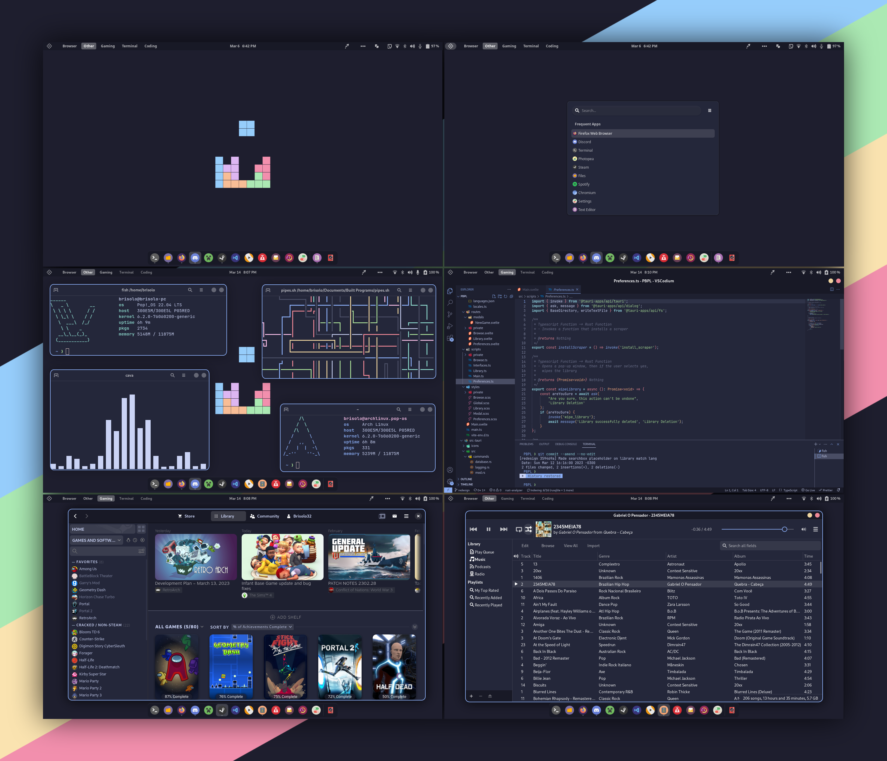

# Dotfiles

These are the dotfiles i use for my system.
Old config files are stored under `config/Not_Used`

An script is also provided to install it, to run just clone the repo and run `./install.sh`

---

## Screenshot:

---

## Current System:

- PC: Samsung Expert x22

  - Intel i5 7200u
  - Intel HD Graphics 620
  - 12GB Ram
  - 512gb SSD

- OS: Pop!\_OS

- Extensions
  - ArcMenu
  - Color Picker
  - Dash to Dock for COSMIC
  - GSConnect
  - Just Perfection
  - Rounded Window Corners
  - Space Bar
  - Top Bar Organizer
  - Top Panel Workspace Scroll
  - Tray Icons: Reloaded
- Apps
  - Nautilus (File Browser)
  - [Firefox](https://mozilla.org/en-US/firefox/new) (Browser)
  - [VSCodium](https://vscodium.com) (Code Editor)
  - gnome-terminal (Terminal)
  - [pfetch](https://github.com/dylanaraps/pfetch) (Fetch Script)
- Colour Palette: [Catppuccin Macchiato](https://github.com/catppuccin/catppuccin)
- [Dotfiles](https://github.com/brisolo32/dotfiles) (Wallpaper also there)

- Theme

  - GTK Theme + Shell Theme
    - [Catppuccin GTK](https://github.com/catppuccin/gtk)

- Fonts
  - Cantarell Regular (Interface, Document)
  - JetBrains Mono (Monospace)
  - Cantarell Bold (Legacy Window Titles)
